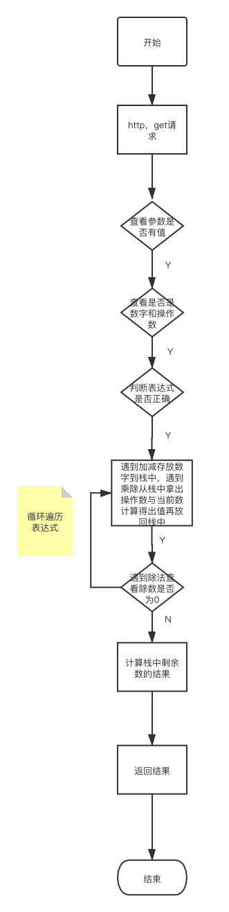

# Go技术文档大纲-计算器

## 1.整体框架

​	使用Gin框架完成一个接口：实现了简单计算器，通过http发送表达式请求，来进行后端计算在返回值。考虑了get请求和post请求分别做了相应的处理，并使用了两种方法进行了实现，一种是用一个变量存放运算符，另一种是栈来存放运算符。

## 2.目录结构

```
.
├── Readme.md
├── app
│   ├── main
│   └── main.go
├── calculator.png #中缀表示成后缀方法流程图
├── ctr
│   ├── StatusErr.go
│   └── controller.go
├── env
│   ├── app.ini
│   └── parse.go
├── go.mod
├── go.sum
├── model
│   └── model.go #存储结构
├── processon.png #get请求流程图
├── router
│   └── router.go #路由
├── service
│   ├── service.go
│   └── service_test.go
└── test
    ├── __pycache__
    │   └── locust_test.cpython-39.pyc
    ├── cal_test_report.html
    └── locust_test.py


```


## 3.代码逻辑分层

​	

| 层        | 文件夹              | 主要职责               | 调用关系                 | 其他说明 |
| --------- | ------------------- | ---------------------- | ------------------------ | -------- |
| 应用层    | /app/main.go        | 程序启动               | 调用路由层和工具层       |          |
| 路由层    | /router/router.go   | 路由的初始化，路由转发 | 调用控制层               |          |
| 控制层    | /ctr/controller     | 处理请求和构建回复消息 | 被路由层调用，调用服务层 |          |
| service层 | /service/service.go | 计算器业务逻辑         | 被控制层调用             |          |
| model层   | /model/model.go     | 设计数据结构           | 被服务层所调用           |          |


## 4.存储设计

​	

| 内容 | field  | 类型     |
| ---- | ------ | -------- |
| 栈   | Stack  | []int    |
| 栈   | Stack1 | []string |


## 5.接口设计

### 	请求方式

​		http get

### 	接口地址

​		http://127.0.0.1:8000/calculator?expr=3+5/2

### 	请求参数

​		例如expr=3+5/2

### 	响应状态码	

| 状态码 | 说明                 |
| ------ | -------------------- |
| 200    | 成功                 |
| 400    | 请输入表达式         |
| 401    | 有其他的字符         |
| 402    | 有连续操作符         |
| 403    | 最后一位必须为操作数 |
| 404    | 除数不能为0          |

### 	请求方式

​		http 

### 	接口地址

​	http://localhost:8000/calculator2

### 	请求参数

​	表单形式 

| Key  | value   |
| ---- | ------- |
| exp  | 3+5 / 2 |


### 	响应状态码	

| 状态码 | 说明         |
| ------ | ------------ |
| 400    | 请输入表达式 |
| 405    | 计算出现错误 |
| 200    | 成功         |


## 6.todo

1.后期尝试用语法分析器来检查表达式合法性

2.后续拓展% ^等运算符


流程图1 post请求中缀表示成后缀进行计算


流程图2 get请求 一个栈进行运算

